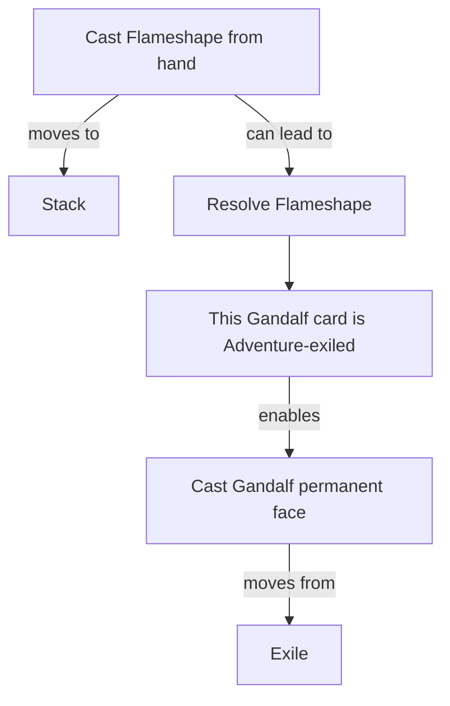

The revised Phase 2 is substantially better. The major structural problems around Adventure, Recruit, Storied, and Saga identity have been corrected. I would not move to Phase 3 quite yet: two mechanistic issues remain blocking, plus a few data corrections.

### Audit result

| Area                         | Status           | Assessment                                                                                                   |
| ---------------------------- | ---------------- | ------------------------------------------------------------------------------------------------------------ |
| JSON/schema integrity        | Pass             | All files parse; no duplicate node/edge IDs or dangling edge endpoints                                       |
| Adventure                    | Pass for Phase 2 | Card-specific exile state prevents one Adventure from enabling another card                                  |
| Gandalf, Friend of the Shire | Pass             | Flameshape follows hand → stack → successful resolution → Gandalf-specific exile state → Gandalf may be cast |
| Cast vs. resolve             | Pass             | Casting now `CAN_LEAD_TO` resolution rather than necessarily causing it                                      |
| Recruit                      | Pass             | One generic Recruit mechanism, instantiated by the ten cards; no ten-token fan-out                           |
| Storied                      | Pass             | Definitions use `QUALIFIES_FOR`; realized battlefield participation is deferred                              |
| Saga identity                | Mostly pass      | Every Saga now has its own lore state                                                                        |
| Saga chapter conditions      | Fail             | Chapter abilities are enabled without testing the required lore number                                       |
| Hone                         | Fail             | Counters still attach to a global counter type, not a particular Equipment object                            |
| Token definitions            | Mostly pass      | Definitions are richer, but two colors and one spelling error remain                                         |

## Blocking issue 1: Saga chapters lack thresholds

The new graph correctly creates a separate state such as:

```text
state:<saga-face>:lore-count
```

and connects only that state to that Saga’s chapter abilities. That fixes the cross-Saga contamination.

But the current edges are effectively:

```text
own lore count → ENABLES → chapter I
own lore count → ENABLES → chapter II
own lore count → ENABLES → chapter III
```

There is no condition saying:

```text
chapter I: lore count becomes 1
chapter II: lore count becomes 2
chapter III: lore count becomes 3
chapter IV: lore count becomes 4
```

`conditions(1).jsonl` contains only the Recruit condition. Consequently, any lore count appears to enable every chapter.

The agent should create a condition for every chapter ability, approximately:

```json
{
  "id": "cond:<face_id>:chapter-2",
  "condition_type": "state_transition_equals",
  "state": "state:<face_id>:lore-count",
  "value": 2
}
```

Then connect it as either:

```text
lore-state → SATISFIES → chapter-condition
chapter-condition → ENABLES → chapter-2
```

or attach the condition ID directly to the `ENABLES` edge.

The condition should describe the lore count *becoming* the chapter number, not merely being greater than or equal to it. Multi-number chapters should receive separate thresholds or a set of accepted transition values.

## Blocking issue 2: Hone is still insufficiently object-bound

The generic hone rule is now defined only once, which is good. But the card-specific operations still say:

```text
Dwalin add-hone → ADDS_COUNTER → counter:hone
Sting add-hone → ADDS_COUNTER → counter:hone
counter:hone → hone boost
```

That does not represent:

* which Equipment receives each counter;
* how many counters that particular Equipment has;
* which creature that Equipment is attached to;
* that the bonus applies only to the creature equipped by that same Equipment.

The desired mechanism is closer to:

```text
add hone counter(equipment E)
    → modifies hone_count(E)

attached_to(E, creature C)
AND hone_count(E) = n
    → modifies power(C, +n)
```

For Phase 2, this can be a parameterized rule rather than creating states for every battlefield instance:

```text
Equipment E ──HAS_STATE──> hone-count(E)
Equipment E ──ATTACHED_TO──> Creature C
hone-count(E) ──SCALES──> power(C)
```

The binding constraint—both references to `E` mean the same Equipment—is essential.

## Token corrections

Three straightforward fixes are needed in `tokens(1).jsonl`:

| Token                   | Current              | Correct               |
| ----------------------- | -------------------- | --------------------- |
| Dwarf 2/2               | `colors: []`         | `colors: ["R"]`       |
| Bird Soldier 4/4 flying | `colors: []`         | `colors: ["W"]`       |
| Axe Equipment           | “target **creatre**” | “target **creature**” |

Token identity should ultimately be based on the complete characteristics, not name alone:

```text
name + colors + types + subtypes + P/T + abilities
```

That prevents unrelated tokens with the same name from collapsing in future sets.

## What is now correctly handled

The Gandalf/Adventure representation is appropriate for this phase:



Likewise, Recruit is now correctly modeled as one reusable mechanism:

```text
Recruit instance
  → draw a card
  → discard a card
  → if the discarded card is nonland
  → create one Human Soldier
```

The ten Recruit cards instantiate that rule; they do not each become ten independent token producers.

## Verdict

This is no longer a fundamentally defective Phase 2. It is a sound revision with two remaining semantic gaps:

1. add exact Saga chapter-transition conditions;
2. make hone counters and bonuses share the same Equipment variable.

After those and the token corrections, I would accept Phase 2 and proceed. The Phase 3 agent must still process all 210 faces, not merely the 103 faces that currently happen to have graph nodes.
