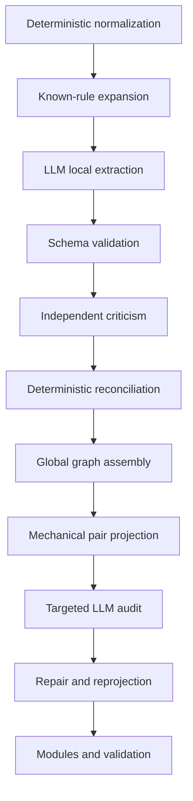

Exactly. The next product is not another set-specific graph; it is a compiler-like harness plus an operational playbook.

The current HOB repository is the worked reference implementation and regression corpus. The reusable system should take:

```text
Set data + Magic rules + mechanic definitions + LLM configuration
                            ↓
            validated mechanistic knowledge graph
```

## What you need

### 1. A set-agnostic software harness

The harness owns everything deterministic:

1. Fetch Scryfall/MTGJSON data.
2. Normalize cards, faces, tokens, costs, types, keywords, and Oracle text.
3. Detect mechanics and relevant Comprehensive Rules.
4. Apply reusable mechanic templates.
5. Generate bounded LLM extraction tasks.
6. Validate and reconcile LLM outputs.
7. Assemble the typed primitive graph.
8. Derive card-pair projections mechanically.
9. Audit uncertain or uncovered relationships with an LLM.
10. Assemble higher-order mechanism modules.
11. Generate coverage, validation, review samples, and query artifacts.

Conceptually:

```text
mtgkg build --set FIN
mtgkg validate --strict
mtgkg review-status
mtgkg query-pair "Card A" "Card B"
mtgkg export
```

### 2. A reusable rules and mechanics library

This is the durable domain knowledge:

```text
rules/
  core/
    casting.yaml
    mana.yaml
    targeting.yaml
    zones.yaml
    attachment.yaml
    triggered_abilities.yaml
    replacement_effects.yaml
    state_based_actions.yaml
  mechanics/
    equip.yaml
    adventure.yaml
    saga.yaml
    amass.yaml
    cycling.yaml
    landfall.yaml
    ...
```

Each template should define:

* recognition pattern;
* Comprehensive Rules reference;
* typed nodes and edges;
* bound variables;
* conditions and state transitions;
* parameters extracted from Oracle text;
* projection grammar;
* semantic invariants;
* test fixtures.

New sets should reuse existing templates and introduce only genuinely new mechanics.

### 3. An LLM orchestration layer

The harness—not the LLM—remains the control plane.

Use LLMs for:

* splitting Oracle text into abilities;
* resolving pronouns and object identity;
* interpreting card-specific triggers and effects;
* binding “it,” “that creature,” “this way,” and “equipped creature”;
* identifying outputs, requirements, costs, scopes, and conditions;
* reviewing candidate pair relationships that deterministic traversal cannot resolve;
* proposing schema-extension requests for genuinely novel mechanisms.

Do not use the LLM for:

* parsing mana symbols;
* parsing type lines;
* enumerating cards and faces;
* assigning stable IDs;
* validating schemas;
* assembling known templates;
* traversing paths;
* generating all ordered pairs;
* deciding whether its own output is valid.

The workflow should remain:



### 4. A model-provider adapter

The current process uses Claude Code agents. The reusable harness should not depend on that particular execution environment.

Define an interface such as:

```python
class SemanticExtractor:
    def extract(self, task: ExtractionTask) -> ExtractionCandidate: ...

class SemanticCritic:
    def critique(
        self,
        task: ExtractionTask,
        candidate: ExtractionCandidate,
    ) -> Critique: ...
```

Implement adapters for:

* CLI coding agents;
* Anthropic API;
* OpenAI API;
* local models;
* cached human-authored responses.

All model calls should produce the same schema and be cached by:

```text
source text
+ rules context
+ prompt version
+ schema version
+ model configuration
```

### 5. A set manifest

A new build should be driven by configuration rather than code edits:

```yaml
project_id: fin
set_code: FIN
source:
  provider: scryfall
  snapshot_date: 2026-08-16

rules_version: "2026-07-31"

mechanics:
  detect_from_source: true
  known_templates:
    - equip
    - landfall
    - cycling

models:
  extractor: claude-code
  critic: claude-code
  require_independent_context: true

projection:
  max_depth: 8
  include_self_pairs: true

review:
  null_pairs: 20
  self_pairs: 10
  multi_edge_pairs: 20
```

The manifest becomes the complete input specification for a build.

### 6. A playbook

The playbook explains how an operator runs and governs the harness.

It should cover:

* prerequisites and environment setup;
* starting a new set;
* source acquisition and freezing;
* mechanic inventory;
* vertical-slice selection;
* LLM extraction and criticism;
* adjudicating disagreements;
* handling schema-extension requests;
* rebuilding after corrections;
* human semantic review;
* acceptance and freeze criteria;
* versioning rules and provenance;
* how to resume after interruption;
* how to compare two set builds.

It should also include decision tables:

| Situation                          | Required response                            |
| ---------------------------------- | -------------------------------------------- |
| Existing mechanic detected         | Apply frozen template                        |
| New named mechanic                 | Stop and request template decision           |
| Familiar effect with new wording   | Use existing primitives; LLM binds semantics |
| Missing predicate                  | Queue schema-extension request               |
| LLM outputs invalid edge           | Reject; do not silently repair               |
| Extractor and critic disagree      | Queue human adjudication                     |
| New source snapshot changes counts | Stop and report                              |
| Coverage gap found                 | Audit → repair → reproject                   |
| Condition cannot be represented    | Preserve as unresolved                       |

### 7. A formal acceptance suite

You need two different validation layers.

Automated structural validation:

* schemas and signatures;
* stable unique IDs;
* endpoint existence;
* condition resolution;
* complete face dispositions;
* complete ordered-pair index;
* expandable paths;
* deterministic rebuilds;
* no unsupported subjective predicates;
* mechanic-specific invariants.

Independent semantic validation:

* stratified human review;
* expected relationships and null relationships;
* correction dispositions;
* reviewer identity and date;
* frozen regression fixtures.

The reviewed examples become a growing cross-set gold set.

## What must be refactored from HOB

The present repository contains several categories that need separation:

* reusable engine code;
* reusable Magic rules;
* HOB-specific configuration;
* HOB-specific UUID repairs;
* HOB-specific mechanism patches;
* generated data;
* audit and review artifacts;
* project history.

Hard-coded card UUIDs and named repairs should become declarative set-local patches:

```yaml
patch_id: hob-dains-company-selection
set: HOB
target_face: ...
reason: missing selection-class binding
operations:
  - add_edge: ...
review:
  status: accepted
  provenance: ...
```

The engine must never contain “Dáin,” “Bothersome Noisemaker,” or HOB UUIDs.

## Recommended repository structure

```text
mtg-mechanistic-kg/
  engine/
  schemas/
  rules/
    core/
    mechanics/
  prompts/
  model_adapters/
  validators/
  queries/
  playbook/
  sets/
    HOB/
      manifest.yaml
      patches/
      review/
      generated/
    FIN/
      manifest.yaml
      patches/
      review/
      generated/
  tests/
    engine/
    rules/
    cross_set/
  cli/
```

## The correct first portability test

Do not begin by processing another entire set. Extract the reusable engine from HOB, then run a small vertical slice from another set containing:

* a basic land;
* a vanilla creature;
* an Equipment;
* a triggered ability;
* a replacement effect;
* a token producer;
* a new set mechanic;
* a multiface card if available.

That test will expose which parts are truly generic and which merely appear generic because they encode HOB assumptions.

So, yes: the deliverables are a playbook and a software harness—but also a versioned rule-template library, model adapter, declarative patch system, and growing semantic validation corpus. Together those form the reusable workflow.
