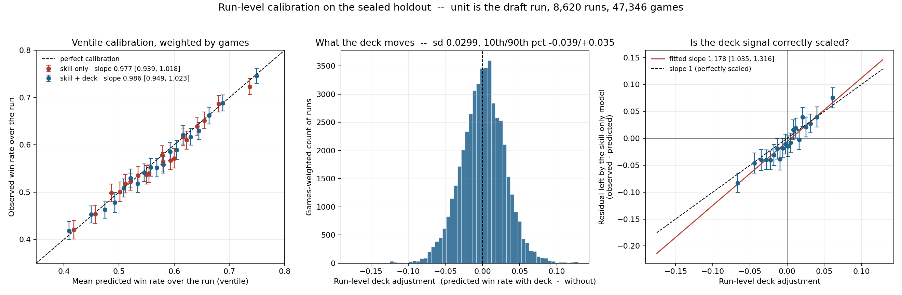

# Run-level calibration on the sealed holdout — derived analysis

**No holdout read was spent producing this.** Every outcome used here comes from the prediction artifacts card 017 committed under `data/runs/` (`obs_id`, `won`, `win_probability`), which exist precisely so that read's numbers can be re-expressed without reopening the seal. `draft_id` is joined from the frozen `model_split.parquet` purely as grouping metadata. `deckbench.holdout.load_holdout` is never called, `repeat=True` appears nowhere, and `cycle/holdout_ledger.jsonl` still records **exactly one read, by card 017**.

Re-expressing one completed measurement in different units is not a second probe. Bootstrapping metric after metric on the holdout until something clears zero would be, and `tools/run_level_calibration.py` is fixed rather than exploratory for that reason: it computes a declared set of quantities and stops.

Regenerate with `python tools/run_level_calibration.py`.

## Why the run, and not the game

Card 008 chose the **game** as the observational unit, deliberately — decks change within 19% of drafts, so collapsing to the draft would force one deck per row. But a Limited player does not experience a game, they experience a **run**: an event that ends at 7 wins or 3 losses. Everything below is that unit.

For each of the 8,620 holdout runs (47,346 games, mean 5.49 games per run):

    predicted win rate = mean of the per-game predicted probabilities
    observed  win rate = wins / games

Models compared are `T2_R0` (skill only) and `T2_R1` (skill + card identity). Fits are weighted least squares weighted by games, so long runs carry the weight they earn. All intervals are the **paired cluster bootstrap over drafts** at the benchmark's declared settings — 1000 replicates, seed 20260908, 95% percentile — using `deckbench.evaluation.bootstrap_replicate_indices`, the same primitive card 017 used.

## Results

| quantity | point | 95% CI | excludes null |
| --- | --- | --- | --- |
| calibration slope, skill only | 0.9774 | [0.9386, 1.0181] | no (null 1) |
| calibration slope, skill + deck | 0.9859 | [0.9494, 1.0228] | no (null 1) |
| calibration slope, difference | +0.0085 | [−0.0090, +0.0239] | no (null 0) |
| **attenuation slope** | **1.1782** | **[1.0355, 1.3156]** | **yes (null 1)** |

### Both models are well calibrated at the run level

Each calibration slope's interval comfortably contains 1, and the ventile points track the diagonal across runs predicted from 31% to 75% win rate. The largest single-bin deviation is 2.2 percentage points; most are under 1.5.

**The difference between them is not a finding.** The point estimates favour the deck model (0.9774 → 0.9859, intercept +0.0071 → +0.0015), but the bootstrap interval on that difference includes zero. An earlier draft of this analysis presented the improvement as real; it is not distinguishable from noise and is stated here as such.

### The model understates the deck effect

Regress the residual the **skill-only** model left on the **deck** model's adjustment:

    y = observed − predicted_skill_only
    x = predicted_with_deck − predicted_skill_only

A slope of 1 means the deck signal is scaled exactly right. Above 1 means the realised effect is larger than the model predicts.

**Slope 1.178 [1.036, 1.316]**, with 99.2% of bootstrap draws above 1 — an understatement of roughly **17.8% [3.5%, 31.6%]**. This is the expected signature of gradient boosting with early stopping: regularisation shrinks predictions toward the mean, and the shrinkage surfaces as attenuation.

Note the width of that interval. *"The model understates the deck effect"* is supported. *"By 18%"* is a point estimate inside a wide interval and should not be quoted as a precise figure.

### The result does not depend on aggregation or binning

| attenuation slope at | rows | slope | intercept |
| --- | --- | --- | --- |
| game level, unbinned | 47,346 | 1.1782 | −0.00629 |
| run level, unbinned (weighted) | 8,620 | 1.1839 | −0.00629 |
| ventile means (as plotted) | 20 | 1.1981 | −0.00642 |

Binning inflates the slope by about 2%, in the expected direction and negligible at this size. The intercept is identical to five decimals at game and run level, which is the weighted means being preserved under aggregation — a check that the collapse did not corrupt anything. **The fits reported above are on unbinned rows; the ventiles are display only.**

### The deck adjustment is not a disguised skill correction

    corr(deck adjustment, skill-only prediction) = +0.0378 (game)   +0.0447 (run)

A concern with the attenuation slope is that `observed − predicted_skill_only` also contains the skill model's own error, so a deck model that quietly repaired skill-side miscalibration would inflate the slope. At r ≈ 0.04 there is almost no shared variance for that to happen through, and the skill-only model is already well calibrated (slope 0.977). The attenuation is the deck signal being shrunk, not a skill artefact.

## Ventile calibration table, skill + deck

| bin | runs | predicted | observed | diff |
| --- | --- | --- | --- | --- |
| 1 | 431 | 0.3101 | 0.3041 | −0.0061 |
| 2 | 431 | 0.4095 | 0.4186 | +0.0091 |
| 3 | 431 | 0.4494 | 0.4532 | +0.0038 |
| 4 | 431 | 0.4746 | 0.4631 | −0.0115 |
| 5 | 431 | 0.4922 | 0.4782 | −0.0140 |
| 6 | 431 | 0.5084 | 0.5089 | +0.0005 |
| 7 | 431 | 0.5210 | 0.5298 | +0.0087 |
| 8 | 431 | 0.5337 | 0.5182 | −0.0154 |
| 9 | 431 | 0.5458 | 0.5410 | −0.0048 |
| 10 | 431 | 0.5572 | 0.5526 | −0.0046 |
| 11 | 431 | 0.5687 | 0.5517 | −0.0170 |
| 12 | 431 | 0.5803 | 0.5580 | −0.0223 |
| 13 | 431 | 0.5924 | 0.5858 | −0.0065 |
| 14 | 431 | 0.6041 | 0.5897 | −0.0145 |
| 15 | 431 | 0.6163 | 0.6211 | +0.0047 |
| 16 | 431 | 0.6297 | 0.6170 | −0.0127 |
| 17 | 431 | 0.6446 | 0.6295 | −0.0151 |
| 18 | 431 | 0.6634 | 0.6620 | −0.0015 |
| 19 | 431 | 0.6880 | 0.6885 | +0.0005 |
| 20 | 431 | 0.7494 | 0.7460 | −0.0033 |

## Translating to whole runs

A Premier Draft run is **stopped**, not fixed-length: it ends at 7 wins or 3 losses, so the number of games is itself a random variable. A per-game win probability `p` therefore cannot simply be multiplied by an average run length. Assuming games within a run are independent at `p`:

    P(finish 7–L) = C(6+L, L) · p⁷ · qᴸ      L = 0, 1, 2
    P(finish W–3) = C(W+2, 2) · p^W · q³     W = 0..6

| per-game p | E[wins] | E[games] | P(trophy) |
| --- | --- | --- | --- |
| 0.450 | 2.396 | 5.32 | 4.98% |
| 0.500 | 2.867 | 5.73 | 8.98% |
| 0.530 | 3.174 | 5.99 | 12.31% |
| 0.550 | 3.388 | 6.16 | 14.95% |
| 0.600 | 3.951 | 6.58 | 23.18% |
| 0.650 | 4.540 | 6.98 | 33.73% |

The 8.98% trophy rate at a 50% win rate matches the observed Arena figure closely, which is a useful sanity check on the stopped-run model.

Because the trophy requires 7 wins, its probability carries `p⁷`: in this range a 1 percentage point change in `p` moves the trophy rate by roughly 1.5–2 points. Small per-game edges compound hard at the top of a run.

**Applied to the holdout predictions**, a bottom-decile deck versus a top-decile deck (−0.037 and +0.037 on `p`, from the median run's 0.5787):

| | per-game p | E[wins] | P(trophy) |
| --- | --- | --- | --- |
| bottom-decile deck | −0.037 | 3.30 | 13.80% |
| median | — | 3.71 | 19.39% |
| top-decile deck | +0.037 | 4.13 | 26.17% |

About **0.83 extra wins per run**, and a trophy rate that nearly doubles.

**This translation is indicative, not measured.** It is a deterministic transform of model predictions with no interval of its own, it assumes independence at constant `p` within a run, and it inherits the attenuation established above — meaning the true gap is likely *wider* than shown, not narrower.

## A mental exercise: if this were the full causal story

> **The premise of this section is not established and is probably false.** Benchmark section 13 is explicit that a predictive increment measured with a fixed learner on a fixed representation does not show that changing a deck would change a win rate. What follows is the arithmetic of *"suppose it did"*, written down because it is a useful way to feel the size of the measured effects — not because the supposition is believed. Reproduce with `python tools/counterfactual_levers.py`.

First, the honest backdrop: **outcomes are mostly coin flips.** About 96% of a single game and 81% of a whole run are unexplained by skill and deck combined. Everything below operates on the remainder.

### The two levers

Spreads in per-game win probability across the holdout population, at run level:

| lever | 10th | 50th | 90th | p90 − p10 | sd |
| --- | --- | --- | --- | --- | --- |
| SKILL (deck fixed) | 0.4347 | 0.5762 | 0.6652 | 0.2305 | 0.0981 |
| DECK (player fixed) | −0.0387 | −0.0005 | +0.0351 | 0.0738 | 0.0299 |
| DECK, attenuation-corrected | −0.0456 | 0.0000 | +0.0414 | 0.0870 | 0.0353 |

The skill lever is about **2.7×** the deck lever.

### Head to head, two otherwise identical players

Computed in log-odds space: a per-game `p` is "win against the average field", so strength is `theta = logit(p) − logit(p_field)` and `P(A beats B) = sigmoid(theta_A − theta_B)`. That composition rule is an assumption layered on the model, not something this project tested.

| scenario | P(A wins) |
| --- | --- |
| same skill, same deck | 50.0% |
| same skill, A top-decile deck vs B median deck | 54.3% |
| same skill, A top-decile deck vs B bottom-decile deck | 58.8% |
| same deck, A 90th-percentile player vs B 10th-percentile | 72.1% |

### Over a whole run, from the median player

| intervention | E[wins] | trophy |
| --- | --- | --- |
| baseline: median player, median deck | 3.679 | 18.97% |
| swap to a bottom-decile deck | 3.181 | 12.39% |
| swap to a top-decile deck | 4.157 | **26.64%** |
| become a 10th-percentile player (deck fixed) | 2.262 | 4.08% |
| become a 90th-percentile player (deck fixed) | 4.721 | **37.37%** |

Deck spans a **2.1×** swing in trophy rate; the player spans **9.2×**.

### Four reasons not to take this literally

**1. `base_p` is not skill, and it contains deck.** This is the serious one. `base_p` is a historical *win rate*, and a win rate is partly produced by the decks that player habitually drafted. Section 13 names exactly this failure: *"skill partially proxies expected deck quality because stronger players draft better decks."* So the SKILL lever above is really **skill plus the deck quality that travels with it**, and the 2.7× ratio is an **upper bound on skill's advantage over deck**, not an estimate of it. A genuine causal decomposition would move some of that span into the deck column.

**2. "Intervening on skill" is not a coherent intervention** in the way swapping a deck is. A player can change decks between drafts; they cannot change their win-rate history.

**3. The deck lever is measured under R1** — normalized card fractions, a deliberately crude representation. The increment it recovers is a floor on what decks do, not a ceiling. R2 and R3 exist for this reason.

**4. The head-to-head composition rule is assumed**, and the attenuation correction (×1.178) carries its own wide interval of [1.036, 1.316].

### The sentence worth keeping

Under the counterfactual, a top-decile deck is worth roughly **+4 percentage points of per-game win rate** against a median one, which **roughly doubles trophy rate** over a run — and it is the lever a player can actually pull, every single draft.

Skill looks larger. But part of what makes skill look larger is deck quality hiding inside the skill proxy. That distinction is the difference between *"decks barely matter"* and *"decks matter, and our skill number is partly made of decks"* — and only the second is consistent with what was measured.

## What this does and does not establish

| claim | standing |
| --- | --- |
| Card identity carries real incremental predictive information | **established** — card 017, all three increments exclude zero |
| Both models are well calibrated at run level | **supported** — both slopes bracket 1 |
| The model understates the deck effect | **supported** — slope excludes 1; magnitude imprecise |
| Adding the deck improves calibration | **not supported** — interval includes zero |
| Bad-deck → good-deck roughly doubles the trophy rate | **indicative** — deterministic transform, no interval |
| The causal lever sizes in "a mental exercise" above | **not a finding** — computed under a premise section 13 rejects |

None of this is causal. Benchmark section 13 governs: a predictive increment measured with a fixed learner on a fixed representation does not establish that changing a deck would change a win rate, and stronger players may draft better decks. The attenuation result sharpens the predictive claim; it does not convert it into a causal one.

## Provenance

- Tools: `tools/run_level_calibration.py` (measurements), `tools/counterfactual_levers.py` (the mental exercise).
- Source artifacts: `data/runs/T2_R0_holdout_predictions.parquet`, `data/runs/T2_R1_holdout_predictions.parquet`, both written by card 017.
- Grouping: `data/processed/model_split.parquet` (frozen, manifest-tracked).
- Bootstrap: 1000 replicates, seed 20260908, 95% percentile, clustered on `draft_id`, via `deckbench.evaluation.bootstrap_replicate_indices`.
- `cycle/holdout_ledger.jsonl` is **unchanged at one line** before and after this analysis.
- `matplotlib` is used for the figure only. It is not in `deckbench.environment.PINNED_VERSIONS` because it touches no fitted artifact and cannot move a result.
